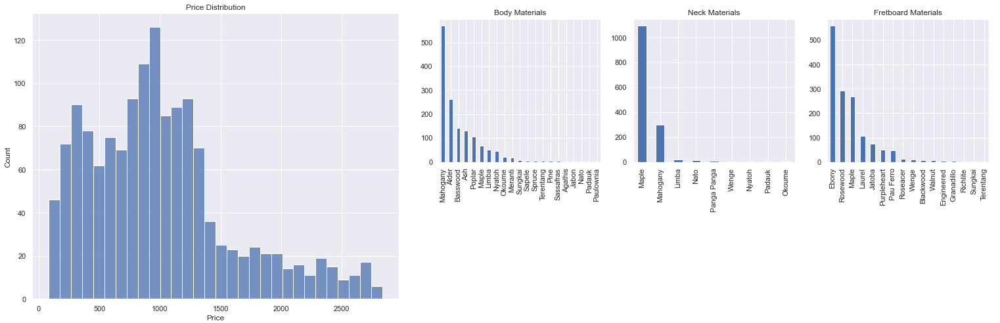

# Electric-Guitar-Price-Prediction: Project Overview
I am plannig to buy a electric guitar in the future, but I do not know what are things I should consider. Therefore, I decided to make some data analysis to understand the what are the important features of an electric guitar that impact the cost, and train a machine learning model to predict the cost of an electric guitar. In order to tackle this problem I performed the following steps:
* I searched the Internet to find a good dataset, but I could not find. So that, I scraped the https://findmyguitar.com/ and collect approximately 1600 electric guitars.
* I performed some data analysis to gain insights from the data.
* I trained various machine learning algorithms to get the best performance. Performance metrics for the best one:
  * Mean Squared Error: 187.6$
  * Mean Absolute Error: 134.5$
  * Mean Absolute Percentage Error: 14% (Maybe this one is a better indicator, since the errors for 2000$ electric guitar and 500$ will be different.)
* Lastly, I productionarize the model with Streamlit library on heroku, so that anyone can enter the site before searching on the internet for electric guitars, and get some general idea about the price for the features that s/he wants. Web site is hosted on https://electric-guitar-price-pred.herokuapp.com/.
## Web Scraping
I scraped about 1600 guitars and from https://findmyguitar.com/. The website includes various features like, the type of woods that are used to construct the guitar, country of origin, brand, hardware featrues like; pickups, tuners, switches etc.
## Data Cleaning
There were some outliers on the dataset in terms of guitar price. They are removed from the dataset. I filled NaN value for some of the Bridg Type values by Bridge name. I extracted the pick ups power from pick up models. For example; a guitar with the <b>Lundgren M6 (Humbucker / Passive)</b> bridge pickup and <b>Sustainiac (Humbucker / Passive)</b> neck pickup, will have the Passive-Passive combination. Passive pickups crate weaker electric signals. Maybe, someone give extra attention to number of frets that the electirc guitar has, so that I extracted number of frets from the frets column.   
## Exploratory Data Analysis
First, I look at the general informaiton that comes to my mind like price distribution, count of woods that is used to construct the electric guitars. 

It looks like most poppular woods are <b>Mahogany</b> for body, <b>Maple</b> for neck, and <b>Ebony</b> for fretboard.    
After that, I analyzed the data more detailed on 5 different category as general product information(country of origin, brand etc.), body part of electric guitars, fretboard, neck part, and lastly hardware/electronics.  
### General Information

We can conclude a lot of information by looking at the price distribution by brands. For example, it supports the information that ESP produces expensive custom guitars and ESP LTD produces more affordable guitars. Harley Benton produces cheaper guitars, or Ibanez produces for all different price segments in the range 200$-2800$. These kind of information can be interpreted. By looking at the price distribution by countries, It is obvious that United States and Japan produces cheaper guitars compared to other countries.   /br>
Correlation matrix shows that brand and country origin are highy correlated with price, and production year somewhat correlated.

### Body Part
### Fretboard Part
### Neck Part
### Hardware/Electronics
Having pickups from top pickup brands and having locking tuners increases the price of an electric guitar, it can be seen from the both price distribution and correlation matrix. Also, there are additional features for hardware that are related with the price, but switch and knob type does not effect the price that much.

## Model Building
## Application
